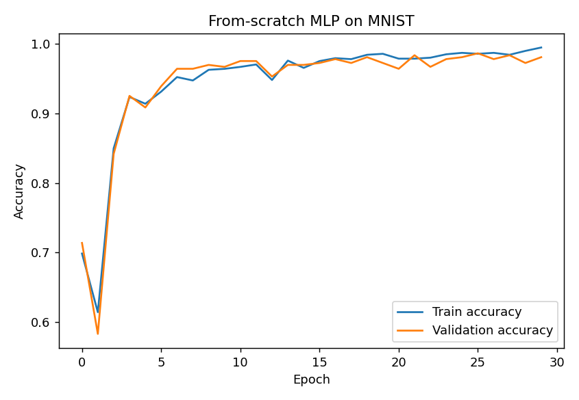
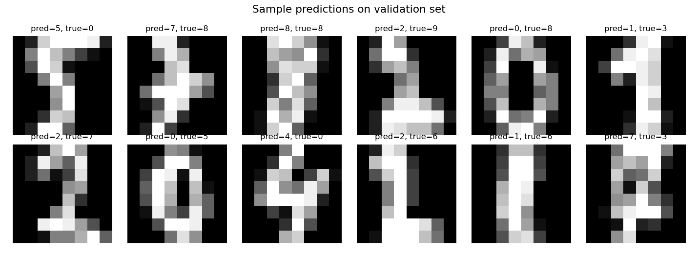
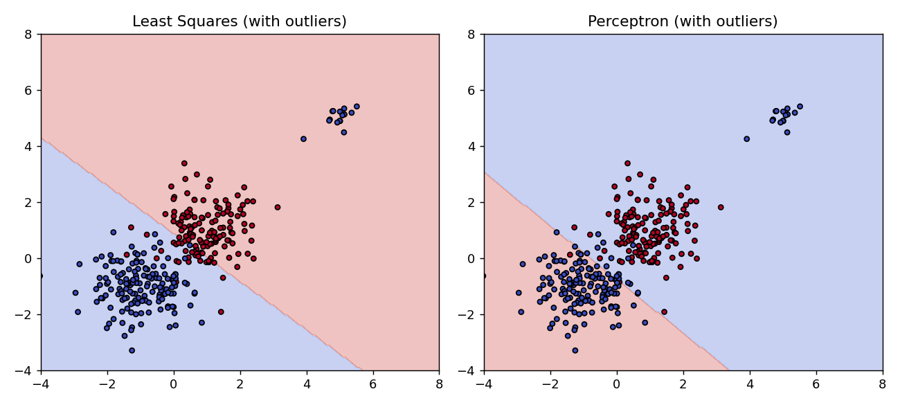
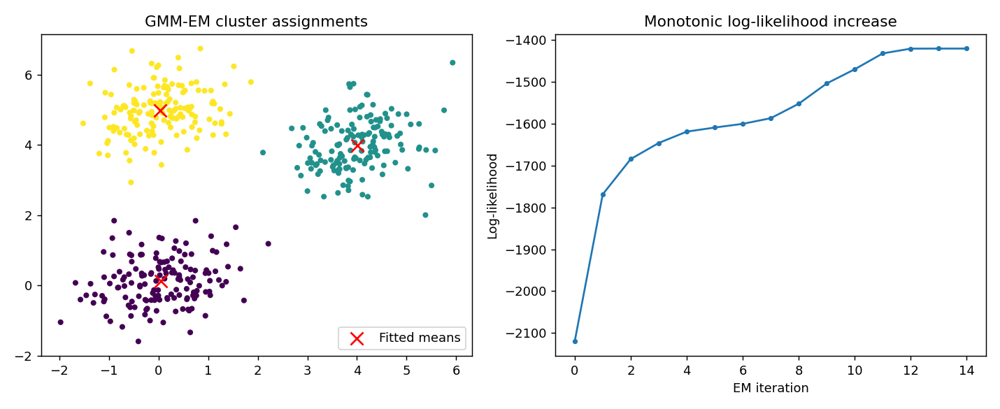
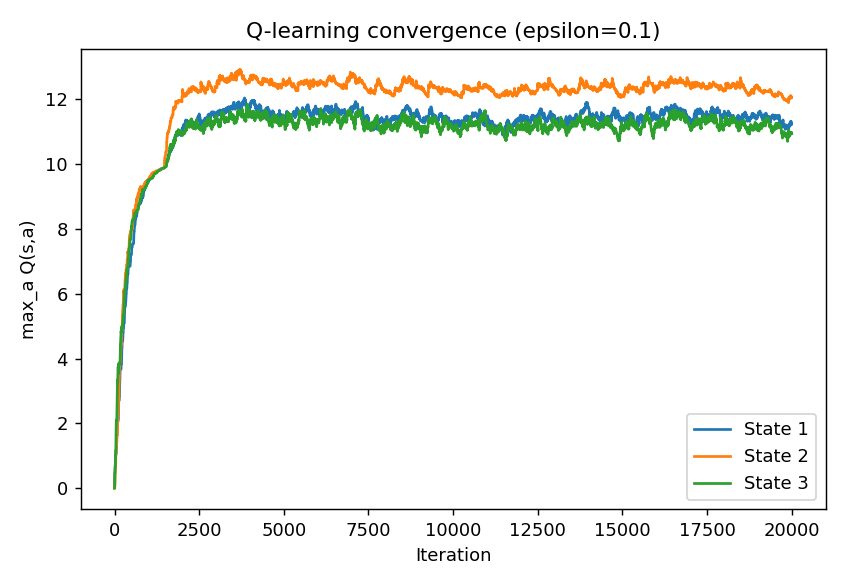
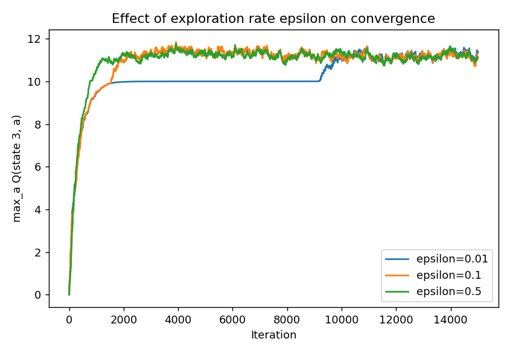

# ML Algorithms from Scratch
Three machine learning paradigms — classical linear classification, deep
learning, and reinforcement learning — implemented from first principles in
NumPy, with no reliance on scikit-learn/PyTorch/TensorFlow for the actual
models. Built out of a Pattern Recognition & Machine Learning course, then
cleaned up, modularized, and documented as a standalone project.

Each algorithm is a small, dependency-light, reusable module with its own
demo script and generated result plots — meant to be readable end-to-end,
not just runnable.

## Why this project
Most ML portfolios lean on `sklearn.fit()`. This one doesn't: every model
here — from a hand-derived backpropagation neural network to tabular
Q-learning — is built from the underlying math up, which demonstrates
actually understanding *how* these algorithms work rather than how to call
a library.

## Contents

| Module | Algorithms | Highlights |
|---|---|---|
| [`neural_network/`](neural_network/) | Feedforward Neural Network | Manual backpropagation, softmax + cross-entropy, trained on MNIST |
| [`classification/`](classification/) | Least Squares, Fisher's LDA, Perceptron, Logistic Regression (IRLS), GMM-EM | Outlier robustness comparison across 4 different classifiers |
| [`reinforcement_learning/`](reinforcement_learning/) | Q-Learning | Model-free tabular RL on a simulated MDP, epsilon-greedy exploration |

## Quickstart

```bash
git clone <this-repo>
cd ml-from-scratch
pip install -r requirements.txt

python neural_network/demo.py
python classification/demo.py
python reinforcement_learning/demo.py
```

Each `demo.py` is self-contained and writes its result plots to `results/`.

## Selected results

**Neural Network** — a from-scratch MLP (hand-derived backprop, no autodiff)
trained on MNIST, showing the training/validation gap that emerges as the
model starts to overfit:

<p float="left">
  
  
</p>

**Classification** — least squares degrades gracefully under outlier
contamination while the perceptron, forced to satisfy every training
constraint, distorts its boundary far more severely; separately, a Gaussian
Mixture Model fit with EM converges with a monotonically increasing
log-likelihood:

<p float="left">
  
  
</p>

**Q-Learning** converges to a stable greedy policy purely from sampled
transitions, with exploration rate controlling the speed/noise tradeoff:

<p float="left">
  
  
</p>

## Design notes

- **No black boxes**: the EM E/M-steps, gradients, and backpropagation are
  all written out explicitly rather than delegated to a library — the point
  of the project is transparency, not performance.
- **`sklearn` is used in exactly one place**: fetching the MNIST dataset in
  `neural_network/demo.py` (data loading only, not modeling). It gracefully
  falls back to a bundled offline dataset if there's no internet access.
- Each module is independently importable (e.g. `from classifiers import
  LogisticRegressionIRLS`) so pieces can be reused outside of the demo
  scripts.
