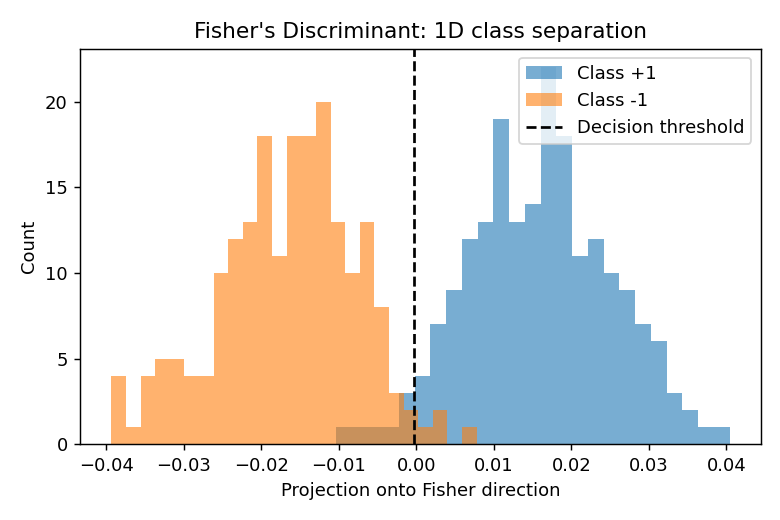

# Linear Classification Models

Five classic linear classifiers, each implemented from first principles:
least squares, Fisher's discriminant, the (pocket) perceptron, logistic
regression via IRLS, and Gaussian Mixture Models fit with EM.

## Files
- `classifiers.py` — `LeastSquaresClassifier`, `FisherDiscriminant`, `Perceptron`, `LogisticRegressionIRLS`, `GaussianMixtureEM`
- `demo.py` — outlier robustness comparison, Fisher projection, GMM-EM clustering

## Run
```bash
python demo.py
```

## Key results

**Robustness to outliers** (two overlapping Gaussian classes, then 15 outliers
injected near the opposite class's territory):

| Model | Clean test accuracy | With outliers |
|---|---|---|
| Least squares | 99.0% | 89.0% |
| Perceptron (pocket) | 99.0% | 8.0% |

Least squares degrades gracefully — it minimizes squared error over *all*
points, so a handful of outliers shift the boundary only moderately.
The perceptron, by contrast, keeps adjusting until it (nearly) satisfies
every constraint including the outliers — on non-separable, contaminated
data this drags the decision boundary far from the true class boundary,
even when reporting the best weights seen during training (the "pocket"
trick). It's a clean illustration of why squared-error and margin-seeking
objectives respond very differently to contamination.

**Fisher's Discriminant** projects the 2D data onto a single axis that
maximizes between-class separation relative to within-class scatter,
achieving 97.3% training accuracy with a 1D decision rule.

**GMM via EM** on a 3-cluster synthetic dataset: the log-likelihood
increases monotonically at every iteration (as EM theory guarantees) and
converges in ~15 iterations.




